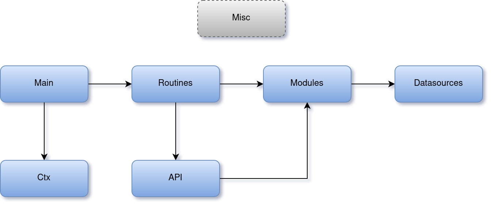

# nxs-go-appctx

This Go package provides a tools to make Go applications context. With the `nxs-go-appctx` you may focus on your application logic instead of write an extensive and difficult system kits to allow your daemons work fine. `Nxs-go-appctx` designed to simplify create REST API applications.

## Features

- **Application context control**  
Most applications consist of goroutines that implements program functionality and context that contains a data (e.g. config option, database connections, etc) used at runtime. `Nxs-go-appctx` allows to control of the derived goroutines and keep context data up-to-dated over an application runtime.

- **Logging**  
`Nxs-go-appctx` uses the [logrus](https://github.com/sirupsen/logrus) logger created at the *init* stage and it's available in application at runtime. In accordance with context settings, log file can be changed after context reload. Also you may choose log format you wish.

- **Pid files**  
If the *pid file* path is set, the pid file with the program PID will be automatically created at the *init* and removed at the *terminate* stage. In accordance with context settings, pid file can be changed after context reload.

- **Reload signals**  
If the *reload signals* is set, every time application will receive specified signals, context data will be updated in accordance with *custom context* `Reload()` function.

- **Termination signals**  
If the *terminate signals* is set, every time application will receive specified signals, context data will be freed in accordance with  *custom context*`Free()` function and the application itself will be terminated.

- **Logrotate signals**  
If the *logrotate signals* is set, every time application will receive specified signals the log file will be reopened. It is useful for `logrotate` utility.

## Getting started

For better understanding the `nxs-go-appctx` see the example in [nxs-go-appctx-example-restapi/](https://github.com/nixys/nxs-go-appctx-example-restapi).

### Setup nxs-go-appctx

Application that uses the `nxs-go-appctx` generally has structure described below.



**Main**

It's a root of the application repository. Besides a codebase helper files this directory consist of:

- `main.go`: may contains only a `main()` with call an `appctx.ContextInit()` function to create an *application context* (`appctx`) with necessary settings and one or more `appCtx.RoutineCreate()` calls to add *application routines*.

To work fine with `appctx` the `main()` must be able to process at least two channels:
- `ac.ExitWait()`: channel tells when an `appctx` is freed and application may be terminated. Usually it happens in following cases:
  - Function `appCtx.ContextTerminate()` called from any part of application
  - Application got the termination signal from system (e.g. `SIGTERM`)
  - Application context `appctx` encountered with an error while processing reload signal (e.g. `SIGHUP`) 

If you haven't a specific logic to process described channels you may use `defer appCtx.MainBodyGeneric()` in `main()`.

**Ctx**

*Custom context* it is a structure stores all data (such as config options, database connections, etc) used through the application. *Custom context* and all of its components describe in `ctx/` directory:

- `ctx/args.go`: defines a function for processing command line arguments, `Args` struct to store read values and one or more helper functions.
- `ctx/conf.go`: defines a function for processing config file, structure (may consist with some nested structures) to store read values from config file and one or more helper functions. It's useful to use [nxs-go-conf](https://github.com/nixys/nxs-go-conf) package to work with config files.
- `ctx/context.go`: defines the *custom context* struct and its three methods:
  - `Init()`: initiates application *custom context*. This function used for read config file, make connections for any DBs and external datasources and store this data into *custom context*.
  - `Reload()`: reloads application *custom context*. This function called in case if application receive reload signal (e.g. `SIGHUP`) and usually only close an external connections and call `Init()` to read updated config file and create new connections.
  - `Free()`: frees application *custom context*. This function used for free the *custom context* (e.g. close an external connections) before program termination.

**Routines**

*Application routines* (or just a *routines*) in `nxs-go-appctx` is a parts of application (i.e. workers) do the specific job such as exec HTTP server, cache daemons and etc. Use `appCtx.RoutineCreate()` call in `main` to create a new *routine*.

Each *routine* describes in separate package within the `routines/` directory and consist of `Runtime()` called from `main()` and may contain other helper functions if it's necessary. The *routine's* `Runtime()` function must have a handlers to catch data at least from two channels:
- `context runtime done()`: for notifications from `appctx` to terminate this *routine*.
- `context reload channel`: for notifications from `appctx` if *custom context* has been reloaded.

If the *routine* encountered with a fatal error it may call `appCtx.RoutineDoneSend()` before terminate to notify `appctx` and send appropriate exit status to `main()`.

Every *routine* interacts with any other part of application or external data only via *modules*. It also able use *api* and helper functions from *misc*.

**Modules**

*Modules* in `nxs-go-appctx` is a blocks responsible for specific logical elements of application.

Each *module* describes in separate package within the `modules/` directory and you may choose for them any structure you want.

For example, if your app has a `user` table in database with raw dataset such as `id`, `name`, `password` and you need to have complex processing of this data (e.g. find all user whose names match specifed regex), you need to create the *module* `modules/user/` with appropriate code.

*Module* must interact only with following application elements:
- Other modules
- DB
- Datasources
- Misc

**API**

This part of application describes REST API and consist of `RoutesSet()` function and handlers to process all requests and methods you need.

*API* must interact only with following application elements:
- Modules
- Misc

**DB**

*DB* describes interaction with databases and has separate packages in `db/` for any database you need to use. The content of packages may has any structure you want.

*DB* must interact only with following application elements:
- Misc

**Datasource**

*Datasource* is the same of *DB* with the difference *datasource* interacts with any external source of data (exclude databases), such as external APIs, files with data, etc.

*Datasource* must interact only with following application elements:
- Misc

**Misc**

*Misc* contain helper functions which used by any part of application.

*Misc* must interact only with following application elements:
- Other miscs

## Install

```
go get github.com/nixys/nxs-go-appctx/v2
```

## Example of usage

See [nxs-go-appctx-example-restapi/](https://github.com/nixys/nxs-go-appctx-example-restapi).
